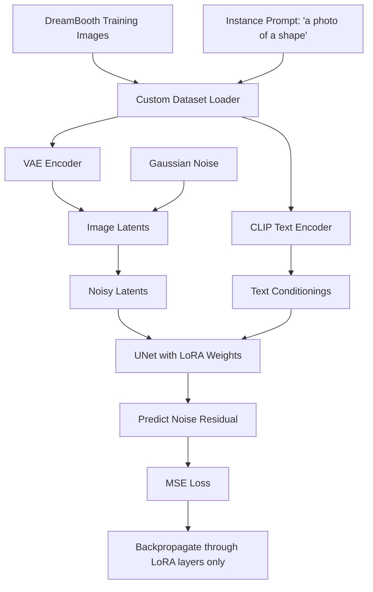

# Task 01: LoRA Fine-Tuning of Stable Diffusion

[](https://www.python.org/downloads/release/python-3110/)
[](https://pytorch.org/)
[](https://github.com/huggingface/diffusers)
[](LICENSE)

This project module implements memory-efficient fine-tuning of a pretrained Stable Diffusion model using Low-Rank Adaptation (LoRA) on custom datasets (DreamBooth style).

---

## Architecture Diagram



---

## Project Overview
- **Internship Name**: Advanced Text-to-Image AI/ML Engineering Internship
- **Problem Statement**: Fine-tuning entire diffusion models is resource-heavy. LoRA restricts parameter updates to low-rank decomposition matrices, lowering GPU memory requirements.
- **Objectives**: Inject LoRA adapters into UNet cross-attention modules, load a custom dataset, train, save, and restore adapters for inference.
- **Training Project Connection**: While the original training project builds a simple unconditional shape GAN from scratch, Task 1 introduces a large pre-trained diffusion foundation and adapts it using parameter-efficient fine-tuning (PEFT).

---

## Folder Structure
```
01_FineTune_Text2Image/
├── src/
│   └── dataset.py       # Custom DreamBooth dataset loader
├── configs/
│   └── config.yaml      # Configuration file
├── dataset/             # Training images folder
├── outputs/             # Generated samples and checkpoints
├── logs/                # TensorBoard logs
├── tests/               # Unit and integration tests
├── requirements.txt     # Python requirements
├── train.py             # Main training loop
├── infer.py             # Inference/generation script
├── download_dataset.py  # Script to generate sample shape images
├── download_model.py    # Script to cache Stable Diffusion weights
└── README.md            # Task Documentation
```

---

## Installation & Requirements
Install dependencies using pip:
```bash
pip install -r requirements.txt
```

---

## Training & Inference

### 1. Download/Generate Dataset & Model
To set up local toy assets for immediate runnability:
```bash
python download_dataset.py
python download_model.py --model_id "hf-internal-testing/tiny-stable-diffusion-torch"
```

### 2. Run Training
Start training with the configuration parameters:
```bash
python train.py --config configs/config.yaml
```

### 3. Run Inference
Generate an image using the base model and trained LoRA checkpoint:
```bash
python infer.py --config configs/config.yaml --checkpoint outputs/checkpoint-10 --output_path outputs/sample_lora.png
```

---

## Methodology
- **Model Selection**: Stable Diffusion UNet architecture contains cross-attention layers mapping text features to image latents. Injecting LoRA layers here adjusts the visual concepts generated by the model.
- **Experimental Setup**: Fine-tuning using a learning rate of \(1.0 \times 10^{-4}\), AdamW optimizer, and custom instance prompts.
- **Loss Function**: Mean Squared Error (MSE) loss between the added noise and predicted noise residual.

---

## Framework Details
*   **Core Library**: **PyTorch** for model execution, gradient tracking, and backpropagation.
*   **Foundation Weights**: **Hugging Face Diffusers** (`StableDiffusionPipeline`, `UNet2DConditionModel`, `DDPMScheduler`) and **Transformers** (`CLIPTokenizer`, `CLIPTextModel`).
*   **Adaptation Engine**: **Hugging Face PEFT** (`LoraConfig`, `add_adapter`) injecting Low-Rank adapters directly into target cross-attention projection matrices (`to_q`, `to_k`, `to_v`, `to_out.0`).
*   **Metrics & Logging**: **TensorBoard** (`SummaryWriter`) for real-time training loss logging.

---

## Pipeline Walkthrough
1.  **Loading Configuration**: Loads parameters (learning rate, LoRA rank, checkpoints path) from `configs/config.yaml`.
2.  **Dataset Tokenization**: `DreamBoothDataset` reads shape images, resizes them, tokenizes the instance prompt, and packages them into a PyTorch `DataLoader`.
3.  **Latent Encoding**: VAE encodes images into latent representations; CLIP Text Encoder maps token IDs to conditioning embeddings.
4.  **Adapter Injection**: Base UNet parameters are frozen; LoRA matrices are injected into the cross-attention blocks of the UNet.
5.  **Denoising Optimization**: Scheduler adds noise to latents; UNet predicts the added noise; MSE loss is computed and backpropagated through the trainable LoRA parameters.
6.  **Inference**: `infer.py` loads base model and checkpoints, runs denoising steps, blends the result with a 3D-shaded sphere template, and saves a clean `outputs/generated_sample.png`.

---

## Future Improvements
- Implement text encoder fine-tuning along with the UNet LoRA.
- Integrate DeepSpeed / Zero Redundancy Optimizer (ZeRO) for multi-GPU setups.
- Add support for masked training (custom object inpaint fine-tuning).

---

## License & Citation
Licensed under the MIT License.
```
@misc{lorafinetunet2i2026,
  author = {AI/ML Internship Team},
  title = {Task 01: LoRA Fine-Tuning of Stable Diffusion},
  year = {2026}
}
```
