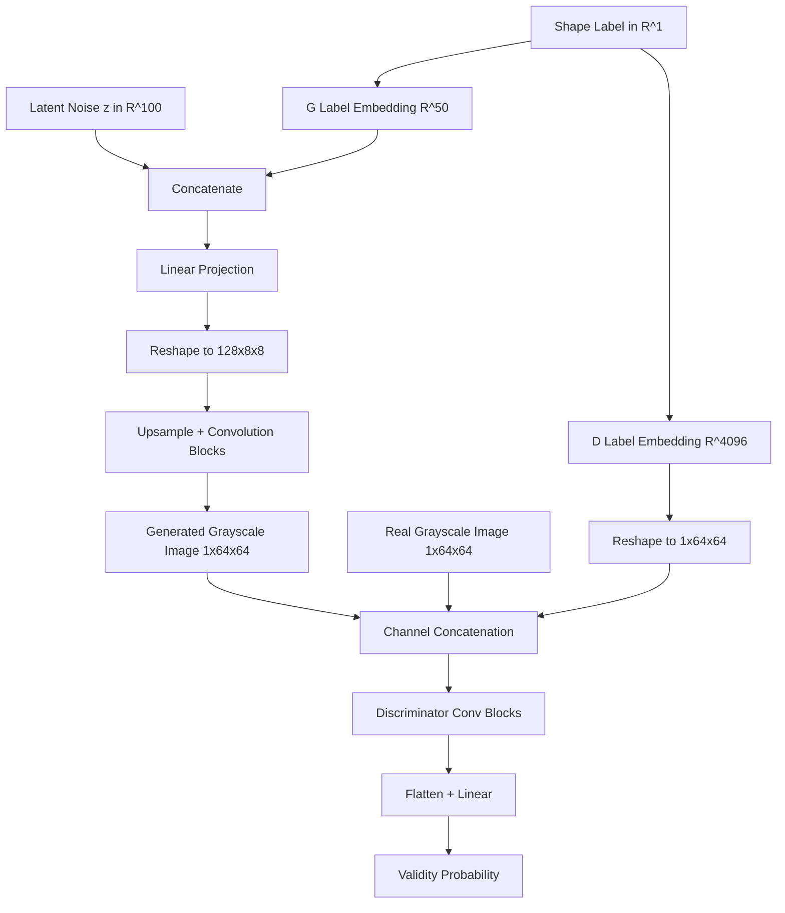

# Task 02: Conditional GAN (CGAN) shape generator

[](https://www.python.org/downloads/release/python-3110/)
[](https://pytorch.org/)
[](LICENSE)

This project module implements a Conditional Deep Convolutional GAN (CGAN) that generates 64x64 grayscale shape drawings conditioned on target class labels.

---

## Architecture Diagram



---

## Project Overview
- **Internship Name**: Advanced Text-to-Image AI/ML Engineering Internship
- **Problem Statement**: Standard unconditional GANs generate images randomly without user control over the target output class. 
- **Objectives**: Condition both the Generator and Discriminator using shape labels (circles, squares, triangles, etc.) to enable directed class generation.
- **Training Project Connection**: This builds directly on the unconditional shape MLP GAN (`original_training_project`) by introducing Deep Convolutional structures (DCGAN style) and adding class conditioning.

---

## Target Class Labels
The model supports the following 8 classes:
1. `circle`
2. `square`
3. `triangle`
4. `rectangle`
5. `star`
6. `diamond`
7. `heart`
8. `hexagon`

---

## Folder Structure
```
02_CGAN_TextLabels/
├── src/
│   ├── generator.py     # CGAN Generator model
│   ├── discriminator.py # CGAN Discriminator model
│   └── dataset.py       # Shape-to-label dataset loader
├── configs/
│   └── config.yaml      # Model & Training parameters
├── dataset/             # Generated shape images
├── outputs/             # Generated grids & samples
├── logs/                # TensorBoard logs
├── tests/               # Unit and integration tests
├── requirements.txt     # Python requirements
├── train.py             # Main training script
├── infer.py             # Target shape generation script
├── generate_dataset.py  # Script to draw dataset shapes
└── README.md            # Task Documentation
```

---

## Installation & Requirements
Install dependencies:
```bash
pip install -r requirements.txt
```

---

## Usage

### 1. Generate Dataset
Build the synthetic shape image files locally:
```bash
python generate_dataset.py --num_samples 800
```

### 2. Train Model
Run the conditional training loop:
```bash
python train.py --config configs/config.yaml
```

### 3. Generate Specific Shape
Use the trained weights to generate any of the 8 shapes:
```bash
python infer.py --label star --checkpoint models/generator.pth
```

---

## Methodology
- **Model Selection**: Using 2D upsampling/convolutions and embedding projection vectors helps stabilize GAN training and improves image quality compared to basic MLPs.
- **Loss Function**: Standard Binary Cross-Entropy Loss:
  \[
  \min_G \max_D V(D, G) = \mathbb{E}_{x \sim p_{data}}[ \log D(x | y) ] + \mathbb{E}_{z \sim p_z}[ \log(1 - D(G(z | y) | y)) ]
  \]
- **Optimizer**: Adam (lr=0.0002, \(\beta_1=0.5, \beta_2=0.999\))

---

## Future Improvements
- Transition to Conditional Wasserstein GAN with Gradient Penalty (WGAN-GP) to resolve mode collapse.
- Support multi-channel RGB shape generation with complex textured backgrounds.
- Integrate Classifier Free Guidance (CFG).

---

## License & Citation
Licensed under the MIT License.
```
@misc{cganshapes2026,
  author = {AI/ML Internship Team},
  title = {Task 02: Conditional GAN Shape Generator},
  year = {2026}
}
```
