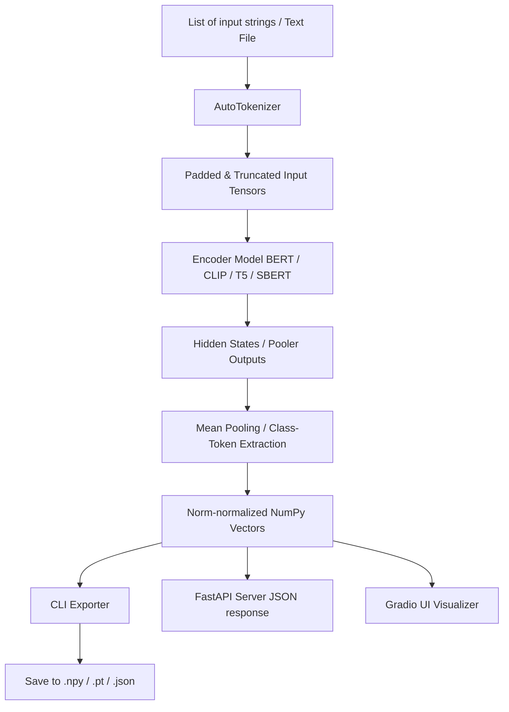

# Task 03: Text Embedding Generation Suite

[](https://www.python.org/downloads/release/python-3110/)
[](https://pytorch.org/)
[](https://fastapi.tiangolo.com)
[](https://gradio.app)
[](LICENSE)

This project module provides a production-ready software suite to encode text queries into high-dimensional vector embeddings using pretrained BERT, CLIP, T5, or Sentence Transformers.

---

## Architecture Diagram



---

## Project Overview
- **Internship Name**: Advanced Text-to-Image AI/ML Engineering Internship
- **Problem Statement**: Text-to-Image models require numerical representation of textual descriptions. Different architectures benefit from different embedding domains (e.g. CLIP for image-text contrast, BERT/T5 for language syntax).
- **Objectives**: Develop a flexible embedding translation module supporting FastAPI endpoints, a Gradio similarity dashboard, and batch local files.

---

## Folder Structure
```
03_TextEmbeddingSoftware/
├── api/
│   └── app.py           # FastAPI server script
├── ui/
│   └── app.py           # Gradio user interface dashboard
├── src/
│   ├── embedder.py      # Embedding generation logic
│   └── benchmark.py     # Performance benchmark suite
├── configs/
│   └── config.yaml      # Configuration settings
├── embeddings/          # Output folder for saved vector files
├── tests/               # Unit tests
├── requirements.txt     # Python requirements
├── cli.py               # Command Line Interface tool
└── README.md            # Task Documentation
```

---

## Installation & Requirements
Install dependencies:
```bash
pip install -r requirements.txt
```

---

## Usage

### 1. Command Line Interface (CLI)
Encode text directly from the terminal and save as a NumPy array:
```bash
python cli.py --text "A blue circle" "A glowing yellow star" --model_type sentence-transformer --format numpy --output embeddings/test_embeds
```

### 2. REST API (FastAPI)
Launch the FastAPI microservice:
```bash
uvicorn api.app:app --host 127.0.0.1 --port 8000
```
Generate embeddings by sending a POST request to `/embed`:
```bash
curl -X POST "http://127.0.0.1:8000/embed" -H "Content-Type: application/json" -d "{\"texts\": [\"A shape on a white background\"], \"model_type\": \"sentence-transformer\"}"
```

### 3. Interactive Web UI (Gradio)
Launch the web interface:
```bash
python ui/app.py
```
Open `http://127.0.0.1:7860` to view the UI.

### 4. Performance Benchmarks
Profile latencies and throughput across models:
```bash
python src/benchmark.py
```

---

## Future Improvements
- Implement vector database indexing (e.g. FAISS, Milvus) for fast similarity searches.
- Expose gRPC endpoints for high-throughput, low-latency enterprise environments.
- Add support for multilingual language backbones (e.g. XLM-RoBERTa).

---

## License & Citation
Licensed under the MIT License.
```
@misc{embeddingsoftware2026,
  author = {AI/ML Internship Team},
  title = {Task 03: Text Embedding Generation Suite},
  year = {2026}
}
```
