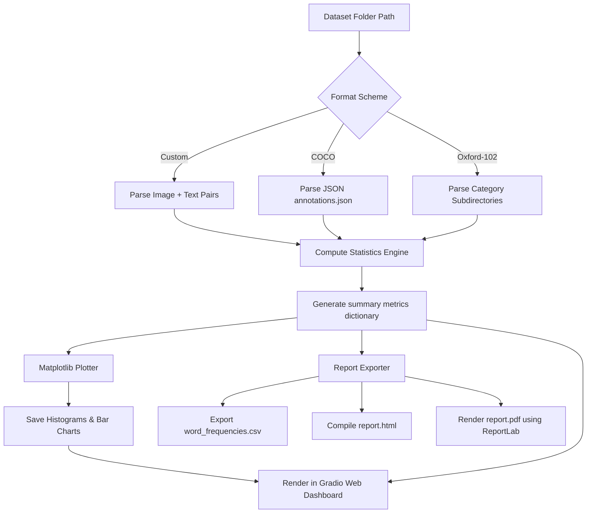

# Task 04: Dataset Explorer & Statistics Suite

[](https://www.python.org/downloads/release/python-3110/)
[](https://gradio.app)
[](https://www.reportlab.com/)
[](LICENSE)

This project module implements an image-caption dataset analyzer and profiling dashboard that supports COCO annotations, Oxford-102 Flowers folder formats, and custom directory schemas.

---

## Processing Workflow Diagram



---

## Project Overview
- **Internship Name**: Advanced Text-to-Image AI/ML Engineering Internship
- **Problem Statement**: Deep learning datasets often contain anomalies (such as misaligned sizes, blank labels, or extreme class imbalances) that degrade model quality during training.
- **Objectives**: Design an automated dataset inspector that computes aspect ratio lists, class distribution counts, word token counts, and generates HTML/PDF statistical summaries.

---

## Folder Structure
```
04_DatasetExplorer/
├── src/
│   ├── analyzer.py      # Core dataset parser and stat engine
│   ├── plotter.py       # Matplotlib & Seaborn chart generator
│   └── reporter.py      # HTML/PDF/CSV report exporter
├── configs/
│   └── config.yaml      # Input paths & parameters
├── reports/             # Output folder for generated PDF/HTML reports
├── plots/               # Output folder for saved distribution images
├── dataset/             # Local sample images and txt files
├── tests/               # Unit testing modules
├── requirements.txt     # Python requirements
├── explore.py           # Command Line Interface execution script
├── app.py               # Gradio dashboard web application
└── README.md            # Task Documentation
```

---

## Installation & Requirements
Install dependencies:
```bash
pip install -r requirements.txt
```

---

## Usage

### 1. Run via CLI
Parse the target dataset directory and save PDF, HTML, and CSV outputs:
```bash
python explore.py --dataset_dir dataset --format custom
```

### 2. Launch Web Dashboard
Open the interactive profiling interface:
```bash
python app.py
```
Open `http://127.0.0.1:7861` to upload directories and view word distributions.

---

## Methodology
- **Statistics Engine**: Parses image headers using PIL to fetch sizes (avoiding heavy tensor loads). Word tokenization is performed after lowercasing, stripping punctuation, and filtering common stop words to get descriptive captions.
- **Reporting Engine**: HTML reports use Jinja2 templating to render structured tables, while PDF generation uses ReportLab platypus flowables to build multi-page vector reports.

---

## Future Improvements
- Integrate CLIP-Score calculation to identify semantic alignment quality between images and text.
- Add an interactive tag editor in the Gradio UI to remove outlier images and update caption text files.
- Enable automatic blurring of private faces / text using pre-trained computer vision models.

---

## License & Citation
Licensed under the MIT License.
```
@misc{datasetexplorer2026,
  author = {AI/ML Internship Team},
  title = {Task 04: Dataset Explorer & Statistics Suite},
  year = {2026}
}
```
