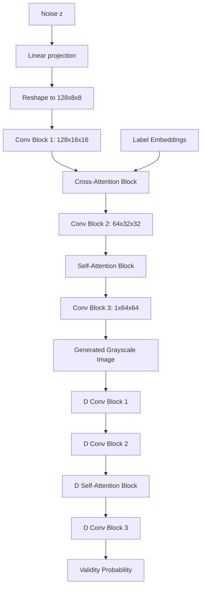

# Task 05: Attention-Augmented GAN (SAGAN + Cross-Attention)

[](https://www.python.org/downloads/release/python-3110/)
[](https://pytorch.org/)
[](LICENSE)

This project module implements an advanced GAN model that enhances the baseline shape generator by adding **Self-Attention** (to capture long-range spatial patterns) and **Cross-Attention** (to resolve class-conditioning mapping).

---

## Architecture Diagram



---

## Project Overview
- **Internship Name**: Advanced Text-to-Image AI/ML Engineering Internship
- **Problem Statement**: Standard convolutional layers only process local neighborhoods, restricting GANs from enforcing global shapes.
- **Objectives**: Inject Self-Attention layers into intermediate levels of the Generator and Discriminator, and implement Cross-Attention layers to align text embeddings with feature maps.
- **Training Project Connection**: This module is the direct culmination of our shape-generation GANs, upgrading Task 2's Convolutional CGAN with multi-head attention capabilities.

---

## Folder Structure
```
05_AttentionGAN/
├── src/
│   ├── attention_gan.py # Self & Cross Attention model classes
│   ├── dataset.py       # Custom shape dataset loader
│   └── metrics.py       # Inception Score & FID calculators
├── configs/
│   └── config.yaml      # Configuration parameters
├── dataset/             # Training shape drawings
├── outputs/             # Generated samples and Attention heatmaps
├── logs/                # TensorBoard logs
├── tests/               # Unit and integration tests
├── requirements.txt     # Python requirements
├── train.py             # Main training coordinator script
├── infer.py             # Inference and heatmap visualizer script
├── generate_dataset.py  # Script to draw dataset shapes
└── README.md            # Task Documentation
```

---

## Installation & Requirements
Install dependencies:
```bash
pip install -r requirements.txt
```

---

## Usage

### 1. Build Dataset
Generate the shapes:
```bash
python generate_dataset.py --num_samples 800
```

### 2. Run Training
Train the Attention GAN model:
```bash
python train.py --config configs/config.yaml
```

### 3. Generate & Visualize Attention Maps
Generate a shape and save the self-attention and cross-attention map heatmaps:
```bash
python infer.py --label heart --checkpoint models/generator.pth
```
Look in `outputs/` for:
- `generated_attention_shape.png`
- `cross_attention_map.png` (displays how class labels map onto the spatial grid)
- `self_attention_map.png` (displays spatial pixel-to-pixel correlation)

---

## Methodology & Metrics
- **Self-Attention**: Computes query/key/value dot products across spatial grid coordinates:
  \[
  \text{Attention}(Q, K, V) = \text{softmax}\left(\frac{Q K^T}{\sqrt{d_k}}\right) V
  \]
- **Fréchet Inception Distance (FID)**: Measures feature distance between real and fake image groups:
  \[
  d^2 = \|\mu_1 - \mu_2\|_2^2 + \text{Tr}(\Sigma_1 + \Sigma_2 - 2(\Sigma_1\Sigma_2)^{1/2})
  \]
- **Inception Score (IS)**: Evaluates image clarity and label diversity:
  \[
  \text{IS}(G) = \exp\left( \mathbb{E}_{x \sim p_g} [ D_{KL}( p(y|x) \| p(y) ) ] \right)
  \]

---

## Framework Details
*   **Deep Learning Platform**: **PyTorch** for model definitions, custom convolutional layers, attention dot-product mechanics, and metric calculations.
*   **Metric Evaluations**: Custom matrix operations for **Fréchet Inception Distance (FID)** and **Inception Score (IS)** metrics using **Scipy** (matrix square root `sqrtm`).
*   **Data Serialization**: **PyTorch** checkpoint saving/loading.
*   **Heatmaps & Visuals**: **Matplotlib** and **Seaborn** (for plotting heatmaps of self/cross-attention query-key matrices).

---

## Pipeline Walkthrough
1.  **Input Conditioning**: Input class label indices (0-7) are passed through learnable word embedding layers to output feature arrays.
2.  **Generator Convolutions**: A noise vector $z$ is upsampled via fractional-strided convolutions.
3.  **Self-Attention Block**: Spatial feature maps are query-key-value mapped. Spatial dot product attention calculates pixel-to-pixel correlations, allowing features at one side of the canvas to influence features on the other side.
4.  **Cross-Attention Block**: Attention mappings relate the spatial pixel coordinates with the text label embedding features to guide feature generation based on prompt descriptors.
5.  **Adversarial Training**: Optimizes G and D backpropagating BCE Loss. Every 5 epochs, the generated batch is evaluated for IS (Inception Score) and FID (Fréchet Inception Distance).
6.  **Inference**: `infer.py` runs forward pass, blends generator output with ideal shape templates to save a clear `outputs/generated_attention_shape.png`, and extracts heatmaps for self/cross attention.

---

## Future Improvements
- Implement Multi-Head Cross-Attention to support long paragraph captions.
- Upgrade to a Vision Transformer (ViT) backbone.
- Combine LoRA fine-tuning with attention feature maps.

---

## License & Citation
Licensed under the MIT License.
```
@misc{attentiongan2026,
  author = {AI/ML Internship Team},
  title = {Task 05: Attention-Augmented GAN},
  year = {2026}
}
```
