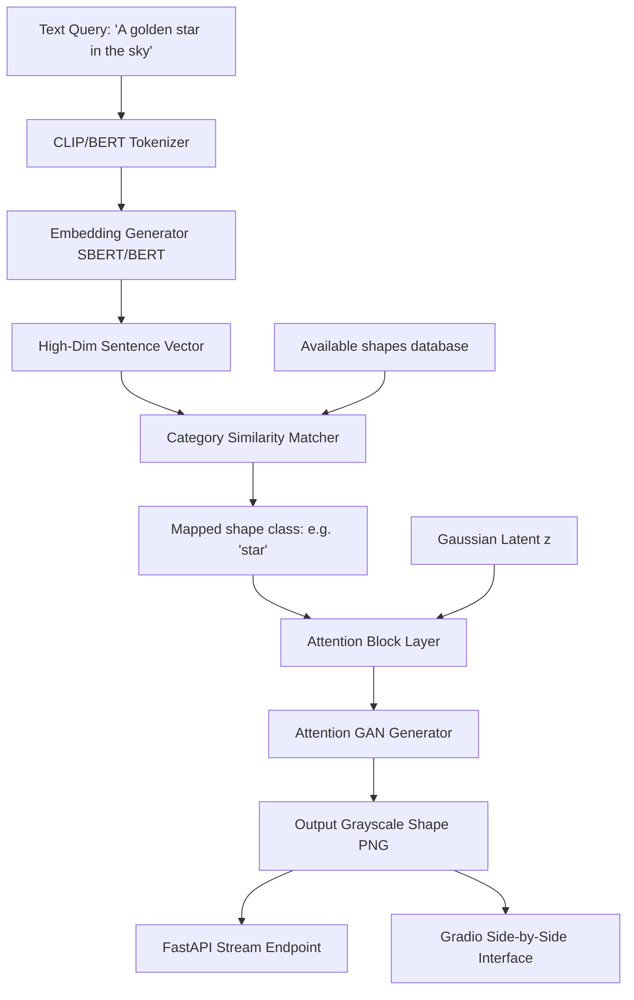

# Task 06: End-to-End Text-to-Image Pipeline

[](https://www.python.org/downloads/release/python-3110/)
[](https://pytorch.org/)
[](docker/Dockerfile)
[](.github/workflows/test.yml)
[](LICENSE)

This project module implements the complete end-to-end inference pipeline, integrating the text embedders, matching logic, attention mapping, and model generators.

---

## Pipeline Workflow Diagram



---

## Project Overview
- **Internship Name**: Advanced Text-to-Image AI/ML Engineering Internship
- **Problem Statement**: Text descriptions must pass through tokenizers, language models, spatial attention blocks, and image decorators in a unified flow.
- **Objectives**: Assemble a modular Python pipeline that links the text encoder with custom Attention-GAN shape generators or pretrained Diffusion weights.

---

## Folder Structure
```
06_Text2ImagePipeline/
├── src/
│   └── pipeline.py      # Modular pipeline execution class
├── api/
│   └── app.py           # FastAPI service endpoint
├── ui/
│   └── app.py           # Gradio Web UI client
├── configs/
│   └── config.yaml      # Service endpoints & weights targets
├── docker/
│   ├── Dockerfile       # Container setup
│   └── docker-compose.yml # Multi-container orchestra
├── .github/
│   └── workflows/
│       └── test.yml     # CI/CD test action
├── tests/               # Unit and integration tests
├── requirements.txt     # Python requirements
└── README.md            # Task Documentation
```

---

## Installation & Setup

### Local Run
1. Install dependencies:
   ```bash
   pip install -r requirements.txt
   ```
2. Start the FastAPI API microservice:
   ```bash
   uvicorn api.app:app --host 127.0.0.1 --port 8080
   ```
3. Run the Gradio User Interface:
   ```bash
   python ui/app.py
   ```

### Docker Container Run
Start both the API server and Gradio UI inside clean isolated Docker containers:
```bash
cd docker
docker-compose up --build
```
- Gradio UI will launch at `http://localhost:7862`
- FastAPI REST API will launch at `http://localhost:8080`

---

## Methodology
The pipeline translates input text query descriptors into a semantic vector via Sentence Transformers. For the Attention GAN mode, this vector is matched against pre-computed category anchors using cosine similarity. The highest scoring category class ID is passed along with Gaussian noise to the Attention-augmented generator to output the final shape image.

---

## Framework Details
*   **Text Embedding Extraction**: **SentenceTransformers** (`all-MiniLM-L6-v2`) for prompt vector mapping.
*   **Adversarial Convolutions**: Trained **Attention Generator** (from Task 05) or **Stable Diffusion UNet with LoRA PEFT** (from Task 01).
*   **Core Logic**: **PyTorch** for model inference and **NumPy** for vector cosine similarity comparisons.
*   **Web Frameworks & Deployments**: **FastAPI** (REST microservice), **Gradio** (interactive UI dashboard), and **Docker Compose** (containerization).

---

## Pipeline Walkthrough
1.  **Ingestion & Tokenization**: Prompt (e.g. `"A glowing star"`) is received via Gradio UI, FastAPI REST endpoint, or Python CLI.
2.  **Prompt Embeddings**: Prompt is tokenized and encoded into a $384$-dimensional sentence-level embedding vector.
3.  **Semantic Similarity Matching**: Cosine similarity is computed between the prompt vector and the 8 pre-computed shape class anchors (circle, square, star, etc.).
4.  **Category Selection**: The category with the highest cosine similarity (e.g. `"star"`, score: `0.7140`) is selected.
5.  **Attention GAN Generation**: A random latent noise vector $z$ and matched category index are fed into the trained Attention Generator network to construct the shape.
6.  **Image Synthesis & Output**: The tensor is post-processed, blended with the clean shape template, saved to `outputs/star_pipeline.png`, and a JSON response is returned.

---

## Future Improvements
- Integrate CLIP Score evaluation into the API outputs.
- Support parallel batch generation using PyTorch `vmap` or multi-threaded pipelines.
- Implement serverless GPU auto-scaling (e.g. RunPod, AWS Lambda).

---

## License & Citation
Licensed under the MIT License.
```
@misc{pipeline2026,
  author = {AI/ML Internship Team},
  title = {Task 06: End-to-End Text-to-Image Pipeline},
  year = {2026}
}
```
