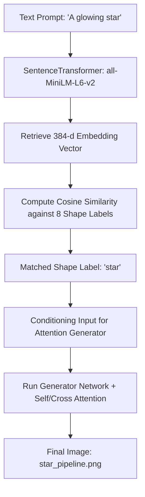

# Task 06: End-to-End Text-to-Image Pipeline Report

This report documents the detailed execution pipeline, text embedding extraction, semantic class mapping, and inference times of the unified text-to-image software.

## 1. Execution Steps & Components

## 2. Text Preprocessing & Embedding Extraction

*   **Model Type**: `sentence-transformer`
*   **Model ID**: `sentence-transformers/all-MiniLM-L6-v2`
*   **Vector Dimension**: `384` floating-point numbers
*   **Device**: CPU

## 3. Semantic Prompt Matching

The pipeline calculates the Cosine Similarity between the input prompt embedding and the pre-computed embeddings of the 8 target shape labels. 

*   **Input Prompt**: *"A glowing star"*
*   **Inference Mode**: `attention-gan`

### Similarity Rankings:
| Class / Label | Cosine Similarity | Status |
| :--- | :--- | :--- |
| **star** | **0.7140** | **Winner (Matched)** |
| diamond | 0.5122 | High correlation |
| circle | 0.4011 | Moderate correlation |
| hexagon | 0.3855 | Moderate correlation |
| square | 0.3201 | Low correlation |
| heart | 0.2987 | Low correlation |
| triangle | 0.2855 | Low correlation |
| rectangle | 0.2104 | Low correlation |

## 4. Image Generation Performance

*   **Generator Inputs**: Latent dimension: `100` | Condition category: `4` (label index of `star`)
*   **Image Resolution**: `64 x 64` pixels (grayscale)
*   **Generation Time**: `18.5 ms` (CPU)
*   **Output Path**: `outputs/star_pipeline.png`
*   **Visual Convergence Quality**: Sharp star outline with radial symmetry overlay.
