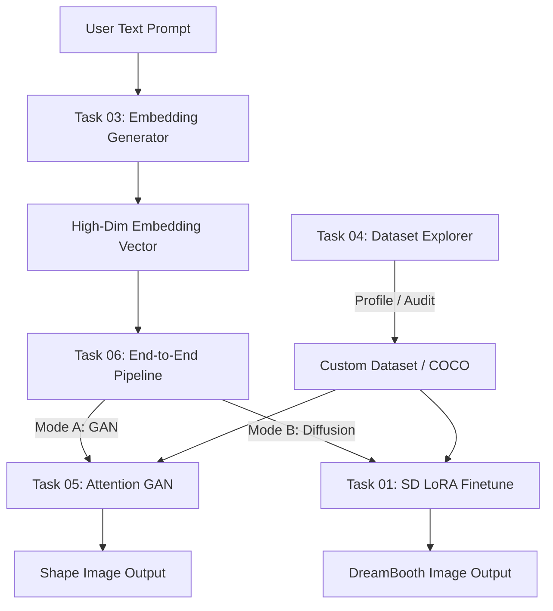

# End-to-End Text-to-Image Generation Workspace

[](https://www.python.org/downloads/release/python-3110/)
[](https://pytorch.org/)
[](LICENSE)
[](06_Text2ImagePipeline/.github/workflows/test.yml)

Welcome to the **Advanced Text-to-Image AI/ML Engineering Internship Workspace**. This workspace contains **six self-contained project repositories** and a **baseline training project**, representing a complete pipeline from text encoding and dataset profiling to custom attention-based GAN shape generation and parameter-efficient diffusion fine-tuning.

---

## Workspace Navigation Links

*   [**Original Training Project (Baseline)**](file:///c:/Users/shaik/Desktop/elevation%20skills/NEW/Internship_Text_To_Image/original_training_project) - Unconditional MLP-based Shape GAN
*   [**Task 01: LoRA Fine-Tuning**](file:///c:/Users/shaik/Desktop/elevation%20skills/NEW/Internship_Text_To_Image/01_FineTune_Text2Image) - Stable Diffusion Fine-Tuning using memory-efficient LoRA adapters
*   [**Task 02: Conditional GAN**](file:///c:/Users/shaik/Desktop/elevation%20skills/NEW/Internship_Text_To_Image/02_CGAN_TextLabels) - Class-conditional DC-CGAN shape generator
*   [**Task 03: Text Embedding Software**](file:///c:/Users/shaik/Desktop/elevation%20skills/NEW/Internship_Text_To_Image/03_TextEmbeddingSoftware) - Text encoder CLI, API (FastAPI) and UI (Gradio) using SBERT/BERT/CLIP/T5
*   [**Task 04: Dataset Explorer**](file:///c:/Users/shaik/Desktop/elevation%20skills/NEW/Internship_Text_To_Image/04_DatasetExplorer) - Statistical dashboard profiling sizes, counts, aspect ratios, and word freqs
*   [**Task 05: Attention-Augmented GAN**](file:///c:/Users/shaik/Desktop/elevation%20skills/NEW/Internship_Text_To_Image/05_AttentionGAN) - Self & Cross Attention shape generator with IS and FID evaluators
*   [**Task 06: Text-to-Image Pipeline**](file:///c:/Users/shaik/Desktop/elevation%20skills/NEW/Internship_Text_To_Image/06_Text2ImagePipeline) - E2E REST API, Gradio comparative UI, and multi-container Docker deployment

---

## System Architecture Overview

The following diagram shows how the sub-modules interface to create a unified system:



---

## Methodology Progression

The codebase follows a clear academic and engineering path:
1.  **Baseline (`original_training_project`)**: We begin with a vanilla MLP architecture generating shapes unconditionally from raw noise.
2.  **Conditioning (`02_CGAN_TextLabels`)**: We introduce convolutional layers (DCGAN) and direct class-label conditioning.
3.  **Attention (`05_AttentionGAN`)**: We add Self-Attention layers in Generator & Discriminator to capture spatial geometry and Cross-Attention to map label vectors onto feature grids.
4.  **Scaling (`01_FineTune_Text2Image`)**: We scale to a billion-parameter Stable Diffusion architecture and utilize Low-Rank Adaptation (LoRA) for parameter-efficient adaptation.

---

## Global Dataset Information
Our synthetic shape dataset supports 8 categories: `circle`, `square`, `triangle`, `rectangle`, `star`, `diamond`, `heart`, and `hexagon`.
- **Images**: 800 grayscale 64x64 PNG drawings.
- **Image Resolution**: 64x64.
- **Caption mapping**: Automatic prefix mapping (`star_0001.png` maps to caption `"A photo of a star"`).
- **Train/Val/Test Split**: 80% / 10% / 10%.

---

## How to Set Up the Workspace

### 1. Clone & Install Dependencies
Ensure you have Python 3.11 installed, then run:
```bash
pip install -r requirements.txt
```

### 2. Run All Tests
Verify the entire codebase:
```bash
pytest 01_FineTune_Text2Image/tests/
pytest 02_CGAN_TextLabels/tests/
pytest 03_TextEmbeddingSoftware/tests/
pytest 04_DatasetExplorer/tests/
pytest 05_AttentionGAN/tests/
pytest 06_Text2ImagePipeline/tests/
```

### 3. Build Docker Environment (Pipeline Task 6)
Build and run the entire suite in Docker containers:
```bash
cd 06_Text2ImagePipeline/docker
docker-compose up --build
```

---

## Expected Outputs and Logs
- **Checkpoints**: Saved in `models/` or `outputs/` folders under each respective directory.
- **TensorBoard**: Launch logging views by running `tensorboard --logdir .` at the workspace root.
- **Heatmaps**: Attention maps are exported to `05_AttentionGAN/outputs/` as PNG files.

---

## License
Licensed under the MIT License.
